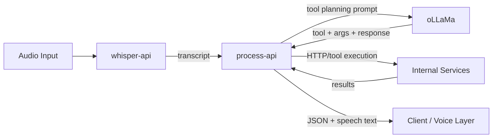
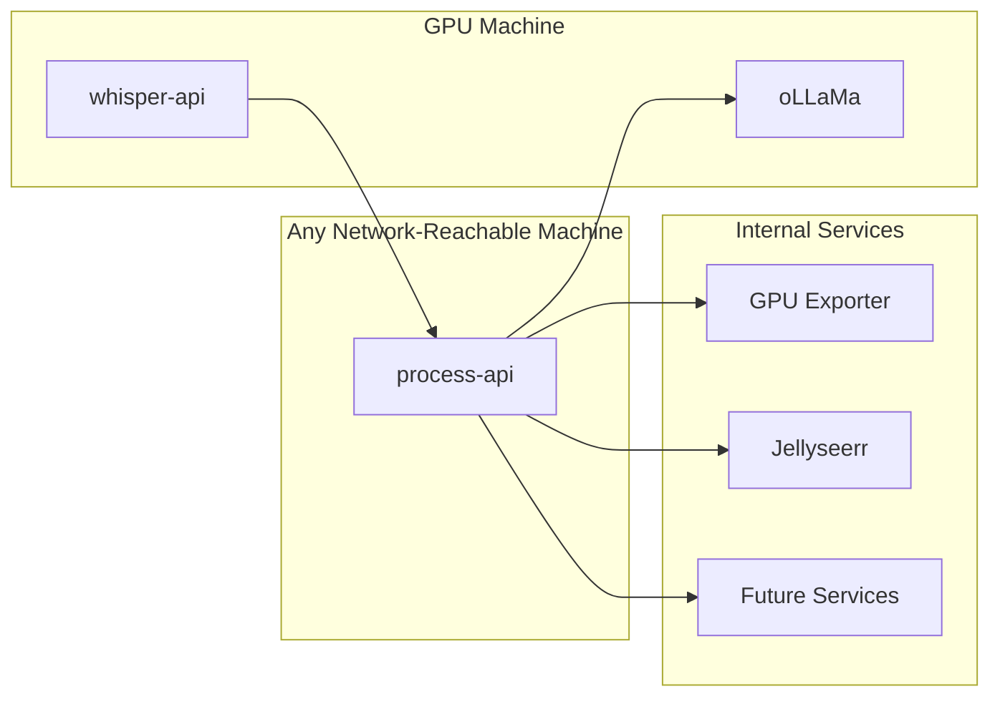
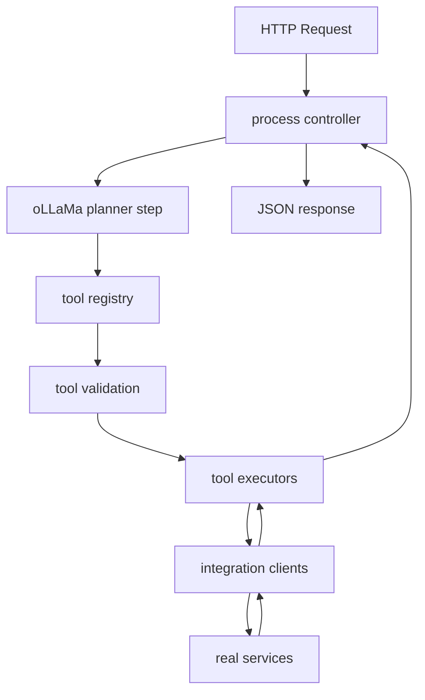

# Architecture

## Overview

Diakonos-Assist is currently organised around a lightweight orchestration service and a small number of specialised upstream services.

The practical architecture is:

- `whisper-api` handles speech-to-text
- `ollama` handles planning / LLM inference
- `process-api` handles orchestration, validation, execution, and response shaping
- internal homelab services provide the actual functionality

The important point is that `process-api` is the coordinator, not the heavy AI runtime.

## High-Level Flow

## Deployment Split

### Why this split

`ollama/` and `whisper-api/` should live on a GPU machine because they are inference-heavy.

`process-api/` can run almost anywhere because it mainly does:

- HTTP handling
- tool validation
- tool execution dispatch
- response formatting
- logging

## `process-api` Internals

### Request modes

`POST /api/v1/process` has two modes:

1. speech mode
2. direct mode

Speech mode:

- input: `{ "speech": "..." }`
- sends available tools to oLLaMa
- receives a selected tool and args
- executes the selected tool

Direct mode:

- input: `{ "tool": "...", "args": {} }`
- skips oLLaMa entirely
- executes the tool immediately

This makes direct mode useful for deterministic testing.

### Internal layers

## Tool System

The tool system is intentionally split into three distinct concerns.

### 1. Tool definitions

Location:

- `process-api/src/tools/definitions/`

Purpose:

- define what the LLM is allowed to choose
- describe arguments and intent at a high level

### 2. Tool registry

Location:

- `process-api/src/tools/registry.ts`

Purpose:

- gather definitions into one catalogue
- expose planner-visible tools
- filter tools based on runtime availability
- provide lookup by tool name

### 3. Tool executors

Location:

- `process-api/src/tools/executors.ts`

Purpose:

- take a validated tool selection
- call the correct integration
- shape the result
- generate a short `speech` string

## Integration Layer

Location:

- `process-api/src/integrations/`

Purpose:

- contain the real request/response logic for upstream services
- isolate auth, base URLs, HTTP request shapes, and parsing

Current integrations:

- GPU status
- Jellyseerr

This layer is where service-specific code belongs. It is not where tool selection belongs.

## Unsupported Requests

Unsupported requests are handled explicitly via:

- `system.unsupported_request`

The planner should choose this when the user asks for something outside the supported tool set.

This avoids forcing random requests into the closest available tool.

## Logging Model

Logging is request-scoped and controlled by `LOG_LEVEL`.

Supported levels:

- `INFO`
- `SUMMARY`
- `NONE`

At `INFO`, the API logs:

- the incoming request
- outbound API calls
- planner selection
- the final request summary

At `SUMMARY`, only the final per-request line is logged.

## What Is Not In This Service

`process-api` does not currently do:

- raw audio ingestion
- speech-to-text
- conversation memory
- clarification dialogues
- dynamic tool registration from a database

Those are either handled elsewhere or are future work.

## Future Direction

The biggest architectural upgrade under consideration is moving tool registration from code to a database-backed registry with a deterministic publishing flow.

See:

- [Tool Registry Future](./TOOL-REGISTRY-FUTURE.md)
