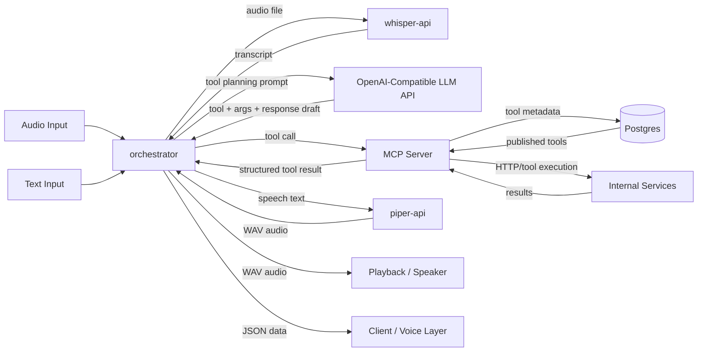
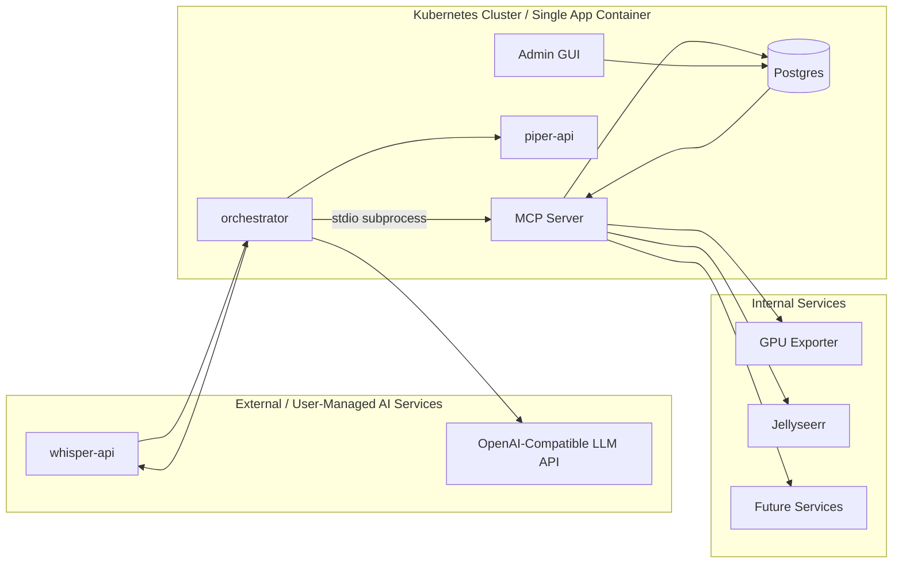
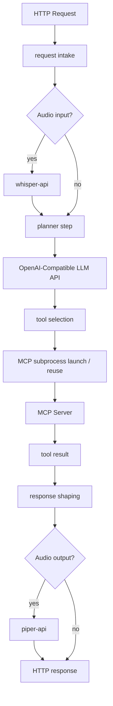
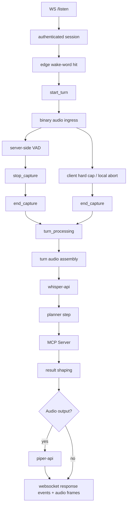
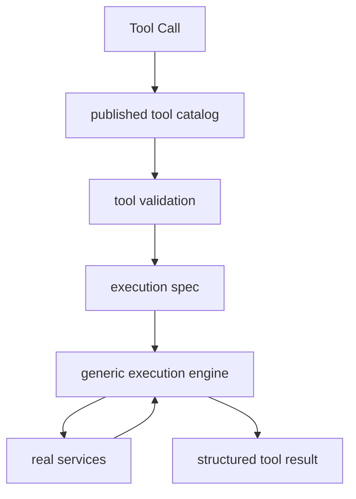

# Architecture

## Overview

Diakonos-Assist is moving toward a split between a user-facing orchestrator and a dedicated MCP tool server.

The target architecture is:

- `orchestrator` handles audio/text intake, planning, response shaping, and voice-pipeline coordination
- `mcp-server` exposes tools, validates tool calls, executes a generic integration skeleton, and returns structured results
- `postgres` stores tool metadata, integration definitions, execution specs, versions, and publication state
- an external OpenAI-compatible LLM API handles planning / LLM inference
- `whisper-api` handles speech-to-text
- `piper-api` handles text-to-speech using Piper's built-in HTTP server and a baked-in local voice model
- internal homelab services provide the actual functionality

The important point is that the orchestrator coordinates the user workflow, while the MCP server owns tool execution.

In the chosen deployment model, the orchestrator starts the MCP server as a local subprocess and communicates with it over stdio. This keeps the distribution model simple while preserving a clear logical split between orchestration and tool execution.

The MCP server is intentionally generic. Service-specific client modules such as `integrations/gpuStatus/client.ts` are not part of the target design. Instead, Postgres defines integrations, request shapes, response extraction rules, and published tool metadata, while the MCP server provides a constrained execution engine that can interpret those definitions safely.

## High-Level Flow

## Deployment Split

### Why this split

`whisper-api/` typically lives on a GPU machine because it is inference-heavy.

The LLM endpoint is intentionally treated as external and user-managed. The orchestrator only needs an OpenAI-compatible base URL, model name, and optional API key. That endpoint might be:

- a home oLLaMa instance
- OpenAI
- OpenRouter
- vLLM
- another OpenAI-compatible provider

`piper-api/` is lighter and can run on CPU, but keeping it on the same AI host usually keeps the voice path simpler:

- STT in
- planning and tool selection in the middle
- TTS out

The orchestrator can run almost anywhere because it mainly does:

- request intake
- speech and text routing
- upstream HTTP calls
- subprocess lifecycle for the local MCP server
- planner coordination
- failure forwarding
- response shaping
- binary audio response handling

The MCP server can also run almost anywhere because it mainly does:

- tool discovery
- tool validation
- generic execution dispatch
- integration calls based on declarative specs
- result shaping

When the orchestrator and MCP server are packaged together, the MCP server does not need its own network API. The orchestrator owns the public HTTP surface and treats the MCP server as an internal child process.

Folding `pipeline-server` into the orchestrator is reasonable because its responsibilities were already orchestration concerns rather than a distinct business domain.

## Orchestrator Responsibilities

The orchestrator replaces the old split between `pipeline-server` and `process-api`.

Its job is:

- receive text requests
- receive uploaded or raw audio
- maintain long-lived device websocket sessions for streamed listen turns
- call `whisper-api` when transcription is needed
- call the configured LLM API to choose a tool and draft a short response
- call the MCP server to execute the selected tool
- call `piper-api` when audio output is required
- return either JSON, plain text, or generated WAV audio
- surface failure context with service and state metadata

### Request modes

The orchestrator should support at least four modes:

1. text planning mode
2. direct tool mode
3. audio pipeline mode
4. streaming listen mode

Text planning mode:

- input: `{ "speech": "..." }`
- sends available tools to the configured LLM API
- receives a selected tool and args
- calls the MCP server with that tool selection
- returns structured JSON plus a voice-friendly response string

Direct tool mode:

- input: `{ "tool": "...", "args": {} }`
- skips the LLM entirely
- calls the MCP server directly
- returns deterministic execution results

Audio pipeline mode:

- input: audio bytes or multipart upload
- sends audio to `whisper-api`
- plans from the transcript
- executes through the MCP server
- optionally synthesises the response through `piper-api`

Streaming listen mode:

- input: long-lived websocket connection plus binary audio frames grouped into discrete turns
- edge device performs wake-word detection locally and owns the pre-roll buffer
- edge starts a turn only after wake-word detection and immediately flushes pre-roll plus live audio
- orchestrator performs server-side VAD and decides when a turn should stop
- orchestrator reuses the same transcription, planning, MCP, and TTS pipeline used by the HTTP audio path
- result data is returned over the websocket as structured events and optional audio frames

This keeps direct mode useful for deterministic testing while giving one service ownership of the full voice path.

### Streaming Listen Protocol

The listen websocket should be a long-lived connection that carries many short half-duplex turns.

In this context, half-duplex means:

- during capture, the client is primarily sending audio
- after `stop_capture`, the server is primarily sending transcript, result, and optional response audio
- only one active capture turn should exist per connection at a time

The protocol should stay simple:

- endpoint: `WS /api/v1/listen`
- auth: device bearer token during websocket upgrade
- control messages: JSON text frames
- audio payloads: binary websocket frames
- default audio format: `pcm_s16le`, mono, `16000Hz`
- v1 transcription model: batch STT after the turn ends, not streaming STT

Recommended client-to-server events:

- `hello`
  - sent once after connect
  - describes device id, firmware version, and supported audio formats
- `start_turn`
  - starts a new utterance after a local wake-word hit
  - includes `turn_id`, audio format, output mode, and metadata such as `pre_roll_ms`
- binary audio frames
  - raw PCM chunks for the active turn
  - first frames may contain the buffered pre-roll audio from before wake-word detection
- `end_capture`
  - indicates the client has stopped sending audio for the current turn
  - sent after a server `stop_capture` in the normal server-ended capture flow
  - may also be sent proactively by the client when it reaches a hard duration cap, loses microphone input, or must terminate capture locally
  - should include a machine-readable reason such as `server_stop_capture`, `max_duration_reached`, `mic_error`, or `user_cancelled`
- `cancel_turn`
  - abandons the current turn if the device times out, loses audio, or the user aborts
- `pong`
  - optional heartbeat response if keepalive frames are used

Recommended server-to-client events:

- `listen_ready`
  - confirms the websocket is authenticated and ready for turns
  - includes server defaults such as expected audio format and max turn length
- `turn_started`
  - acknowledges the `start_turn`
  - may include server-side capture limits for this turn
- `stop_capture`
  - tells the client to stop streaming because VAD or a hard limit determined the utterance is complete
  - client must stop sending audio immediately on receipt
- `turn_processing`
  - indicates capture is complete and STT / planning / execution has started
  - sent after the server receives `end_capture`, whether capture ended because of `stop_capture` or because the client terminated capture locally
- `transcript`
  - returns the final transcript produced for the turn
- `turn_result`
  - returns the same logical payload shape as the HTTP `respond` endpoint
  - should include `transcript`, `selection`, `response`, and `result` when available
- `output_audio_start`
  - declares that audio response frames will follow
- binary audio frames
  - WAV bytes or PCM chunks for playback, depending on the agreed response format
- `output_audio_end`
  - marks the end of response audio for the turn
- `turn_complete`
  - indicates the turn has fully finished and the connection is idle again
- `error`
  - returns structured error information scoped to the connection or a specific turn
- `ping`
  - optional keepalive frame

Recommended turn flow:

Shared turn start:

1. Device connects to `/api/v1/listen` and sends `hello`.
2. Orchestrator authenticates the device and returns `listen_ready`.
3. Device detects the wake word locally.
4. Device sends `start_turn` with a new `turn_id`.
5. Device immediately streams binary PCM frames, starting with buffered pre-roll audio and then live microphone audio.
6. Orchestrator runs VAD over the incoming stream and tracks hard guards such as max utterance length and max silence.

Server-ended capture flow:

7. Orchestrator sends `stop_capture` when VAD or a server-side hard limit decides the capture should end.
8. Device stops microphone streaming immediately and sends `end_capture` with reason `server_stop_capture`.
9. Orchestrator sends `turn_processing`.
10. Orchestrator finalises the buffered audio, runs batch transcription, plans the tool call, executes through MCP, and optionally synthesises speech.
11. Orchestrator sends `transcript`, `turn_result`, and optional response audio frames.
12. Orchestrator sends `turn_complete`.
13. The websocket stays open for the next wake-word turn.

Client-ended capture flow:

7. Device reaches its local hard duration cap or must terminate capture locally.
8. Device stops microphone streaming and sends `end_capture` with a reason such as `max_duration_reached` or `mic_error`.
9. Orchestrator treats the turn as closed to further audio and sends `turn_processing`.
10. Orchestrator finalises the buffered audio, runs batch transcription, plans the tool call, executes through MCP, and optionally synthesises speech.
11. Orchestrator sends `transcript`, `turn_result`, and optional response audio frames.
12. Orchestrator sends `turn_complete`.
13. The websocket stays open for the next wake-word turn.

Operational rules:

- the edge device is responsible for wake-word detection and pre-roll buffering
- the orchestrator is responsible for turn-end VAD, max-duration enforcement, and pipeline execution
- the client must also enforce its own hard safety timeout in case `stop_capture` is never received
- if the client terminates capture locally, it must send `end_capture` and the server should move the turn into processing without waiting for `stop_capture`
- once `stop_capture` has been sent, any additional client audio frames for that turn should be ignored or logged as a protocol violation
- once `end_capture` has been received, any additional client audio frames for that turn should be ignored or logged as a protocol violation
- the server should reject unsupported audio formats at `start_turn` time rather than mid-stream
- each event should carry `turn_id` once a turn exists so logs and failures are traceable
- the websocket should remain open across many turns, but each turn should be isolated in memory and cleanup
- response audio should be optional because some clients may want text or structured JSON only

### Internal layers

Streaming listen should reuse the same core pipeline after audio capture ends:

## MCP Server Responsibilities

The MCP server is the tool execution boundary.

Its job is:

- expose planner-visible tools
- validate tool call arguments
- execute the correct declarative integration spec
- return structured results
- hide unpublished or invalid tools
- keep execution code separate from planner logic

Conceptually, the orchestrator answers "what should be called?" and the MCP server answers "how is that tool actually run?"

### Internal layers

## Tool Metadata And Postgres

Tool metadata and declarative execution specs should move to Postgres, but the execution engine and hard safety rules should remain in version-controlled source.

This is an important distinction:

- Postgres owns metadata and execution specs
- source code owns the execution engine and safety boundaries

The system should not allow arbitrary executable logic to be defined in the database. The database may describe requests and extraction rules, but it should not store free-form code.

### What belongs in Postgres

Store:

- integration transport type
- integration base URL env-var reference
- integration auth strategy and env-var reference
- tool name
- description
- integration key
- argument schema JSON
- execution summary
- execution spec JSON
- enabled or disabled state
- planner visibility
- metadata version
- draft or published state
- human notes

### What stays in source code

Keep:

- generic execution engine
- supported extractor and transformer types
- validation helpers
- hard safety checks
- allow-list of supported protocols, auth modes, and extraction modes

### Suggested entities

A minimal schema should include:

- `integrations`
- `tools`
- `tool_versions`
- `tool_publish_events`
- `resources`
- `resource_versions`
- `resource_publish_events`

The important operational rule is that only published and validated tool metadata should be exposed by the MCP server.

### Declarative execution model

The runtime model is intentionally declarative.

For each published tool version, Postgres should be able to describe:

- how the request is built
- which integration it targets
- which HTTP method and path are used
- how args map into path, query, headers, or body
- which response shape is expected
- how structured output is extracted
- how user-facing text is shaped

This means the MCP server should provide a fixed set of supported execution and extraction modes, for example:

- HTTP request execution
- JSON field extraction
- text extraction
- Prometheus metric extraction
- simple templated result shaping

The MCP server should not evaluate arbitrary scripts from the database.

## Admin GUI

An admin GUI becomes useful once tool metadata lives in Postgres.

It should support:

- creating tool drafts
- editing descriptions and schemas
- toggling planner visibility
- previewing planner-facing tool JSON
- validating metadata against known executor bindings
- publishing and rolling back metadata versions

The GUI should never:

- upload executable code
- define arbitrary executable logic
- bypass integration allow-lists

That keeps the system flexible without turning it into remote code execution.

The admin HTTP API for creating, editing, publishing, rolling back, and deleting tool or resource metadata can reasonably live in the orchestrator because the orchestrator already owns the public API surface. The MCP server should remain read-only with respect to published metadata during normal runtime.

## Integration Layer

Integration clients belong behind the MCP server.

In the target model, "integration layer" means declarative integration definitions plus a generic runtime engine, not handwritten per-service client modules.

Purpose:

- define how upstream services are called in a structured way
- isolate auth mode, base URL env-var references, HTTP request shapes, and extraction rules
- keep planner-facing tool selection separate from execution mechanics

Current integrations expected in this model include:

- GPU status
- Jellyseerr

This layer is where integration specifications belong. It is not where tool selection belongs.

## Unsupported Requests

Unsupported requests should still be handled explicitly.

The planner should choose an explicit unsupported path when the user asks for something outside the published tool set.

This avoids forcing random requests into the closest available tool.

## Logging Model

Logging should stay request-scoped and split by responsibility.

At the orchestrator layer, log:

- incoming request
- transcription step
- planner selection
- MCP calls
- TTS calls
- final request summary

At the MCP layer, log:

- tool discovery or publication state used for the request
- incoming tool call
- validation failures
- outbound integration calls
- final execution summary

## What Is Not In Postgres

Postgres should not store:

- executable code
- auth tokens
- service URLs
- machine-specific settings

Those belong in source control or deployment configuration, depending on the type of data.

## Migration Direction

The safest migration path is:

1. extract tool discovery and execution behind an MCP server
2. define a constrained generic execution engine in source code
3. move tool metadata, integration definitions, and execution specs into Postgres
4. add strict validation between published specs and the engine's supported capabilities
5. add an admin GUI for draft, validate, publish, and rollback workflows
6. fold `pipeline-server` into the orchestrator and retire the split audio path

This gives a cleaner long-term architecture without making the runtime path less deterministic.

## Streaming Listen Implementation Steps

The recommended implementation order for the websocket listen path is:

1. Replace the stub `/listen` handler with a real `ws` server and a connection session abstraction.
2. Move the current HTTP audio pipeline logic into a reusable orchestrator service so HTTP and websocket paths share the same transcription, planning, MCP, and TTS code.
3. Define a strict websocket event schema with `turn_id`, message types, supported audio formats, and structured error payloads.
4. Implement per-connection turn state: current turn, chunk buffering, byte counters, deadlines, and cleanup on disconnect.
5. Add server-side VAD for streamed PCM input and pair it with hard guards such as max utterance duration, max post-speech silence, and max buffered bytes.
6. Build an audio assembly layer that turns inbound PCM chunks into the format expected by the existing Whisper integration.
7. Send `stop_capture` from the orchestrator when VAD or a hard limit decides the utterance is complete, then require the client to answer with `end_capture`.
8. If the client reaches its own hard stop first, require it to send `end_capture` proactively and move the server turn state straight into processing.
9. After `end_capture`, run the existing batch pipeline: Whisper transcription, LLM planning, MCP execution, response shaping, and optional Piper synthesis.
10. Return transcript, structured result, and optional audio response over websocket events that mirror the logical fields of the HTTP `respond` route.
11. Add request-scoped logging for connection lifecycle, turn lifecycle, capture-end reason, VAD stop reason, upstream calls, and per-turn completion summaries.
12. Add protocol tests with recorded PCM fixtures plus at least one device-side smoke test covering wake-word pre-roll, server-stopped capture, client-stopped capture, and multi-turn reuse of the same socket.

## Related Documents

See:

- [Tool Registry Future](./TOOL-REGISTRY-FUTURE.md)
- [Auth And Discovery](./AUTH-AND-DISCOVERY.md)
