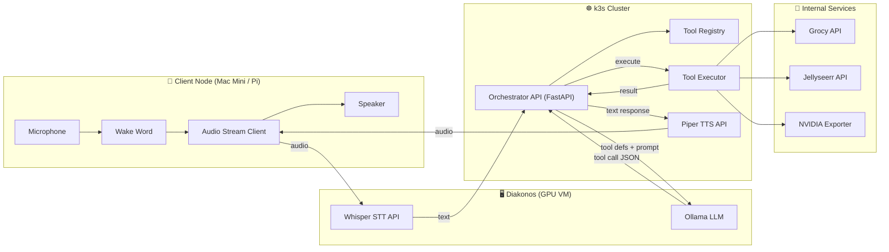
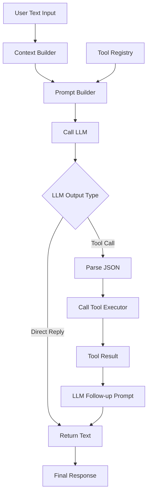
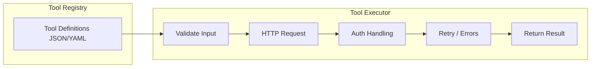
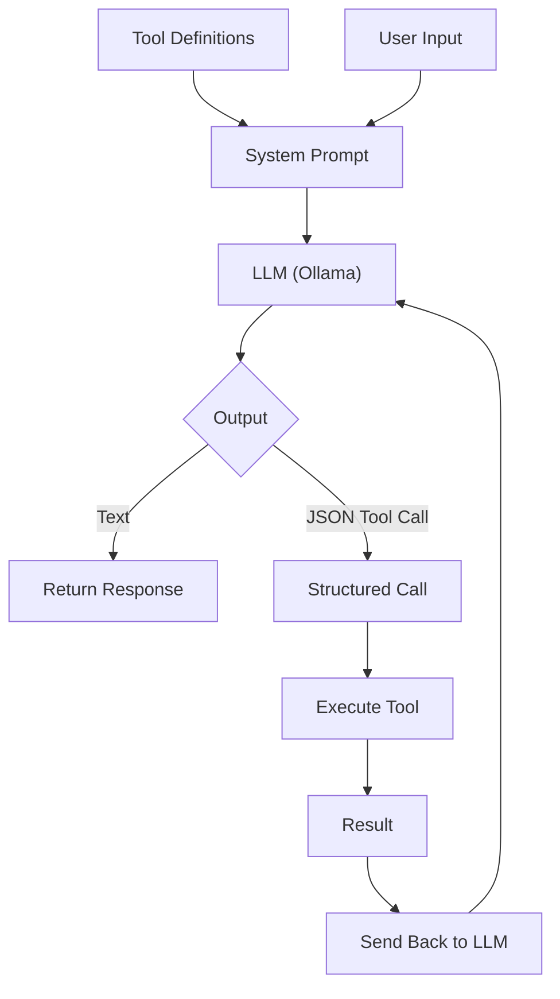
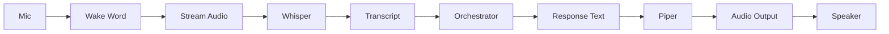
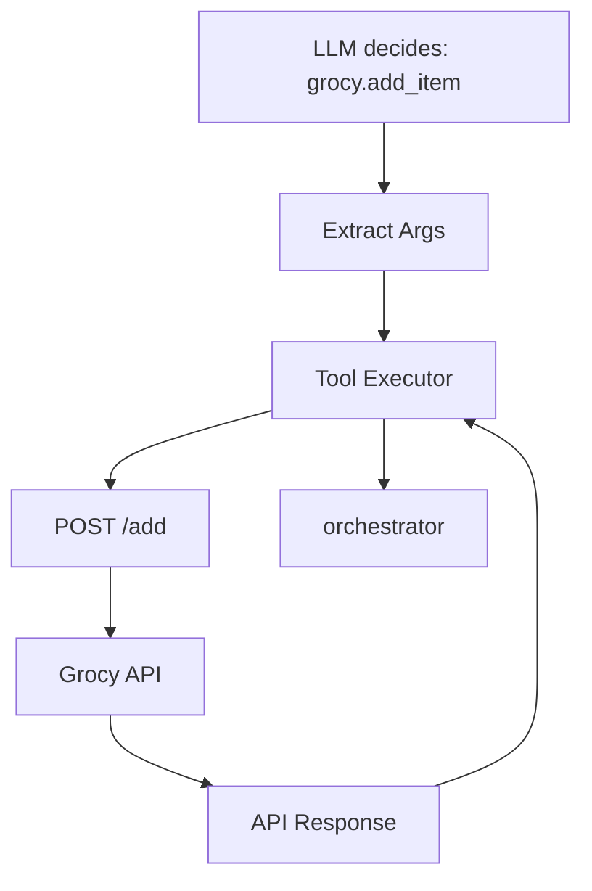
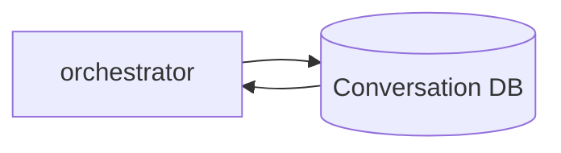

# Architecture

## Overall

```mermaid
flowchart LR

%% CLIENT LAYER
subgraph Client["🎤 Client Node (Mac Mini / Pi)"]
    mic[Microphone]
    wake[Wake Word]
    stream[Audio Stream Client]
    speaker[Speaker]
end

%% GPU SERVER
subgraph Diakonos["🖥️ Diakonos (GPU VM)"]
    stt[Whisper STT API]
    llm[Ollama LLM]
end

%% K3S CLUSTER
subgraph K3s["☸️ k3s Cluster"]
    orchestrator["Orchestrator API (FastAPI)"]
    registry[Tool Registry]
    executor[Tool Executor]
    tts[Piper TTS API]
end

%% SERVICES
subgraph Services["🔌 Internal Services"]
    grocy[Grocy API]
    jellyseer[Jellyseerr API]
    gpu[NVIDIA Exporter]
end

%% FLOW
mic --> wake
wake --> stream
stream -->|audio| stt

stt -->|text| orchestrator
orchestrator -->|tool defs + prompt| llm
llm -->|tool call JSON| orchestrator

orchestrator --> registry
orchestrator -->|execute| executor

executor --> grocy
executor --> jellyseer
executor --> gpu

executor -->|result| orchestrator
orchestrator -->|text response| tts
tts -->|audio| stream
stream --> speaker
```

## Orchestrator

```mermaid
flowchart TD

input[User Text Input] --> ctx[Context Builder]

ctx --> prompt[Prompt Builder]
registry[Tool Registry] --> prompt

prompt --> llmcall[Call LLM]

llmcall --> decision{LLM Output Type}

decision -->|Tool Call| parse[Parse JSON]
decision -->|Direct Reply| respond[Return Text]

parse --> exec[Call Tool Executor]
exec --> result[Tool Result]

result --> followup[LLM Follow-up Prompt]
followup --> respond

respond --> output[Final Response]
```

## Tool System (registry + executor split)

```mermaid
flowchart LR

subgraph Registry["Tool Registry"]
    defs[Tool Definitions JSON/YAML]
end

subgraph Executor["Tool Executor"]
    v1[Validate Input]
    c1[HTTP Request]
    a1[Auth Handling]
    r1[Retry / Errors]
    res[Return Result]
end

defs --> v1
v1 --> c1
c1 --> a1
a1 --> r1
r1 --> res
```

## LLM Interaction

```mermaid
flowchart TD

tools[Tool Definitions] --> prompt[System Prompt]

user[User Input] --> prompt

prompt --> llm["LLM (Ollama)"]

llm --> output{Output}

output -->|Text| text[Return Response]
output -->|JSON Tool Call| json[Structured Call]

json --> exec[Execute Tool]
exec --> result[Result]

result --> followup[Send Back to LLM]
followup --> llm
```

## Voice Pipeline

```mermaid
flowchart LR

mic[Mic] --> wake[Wake Word]

wake --> stream[Stream Audio]

stream --> stt[Whisper]

stt --> text[Transcript]

text --> orchestrator[Orchestrator]

orchestrator --> response[Response Text]

response --> tts[Piper]

tts --> audio[Audio Output]

audio --> speaker[Speaker]
```

## Tool Example

```mermaid
flowchart TD

intent[LLM decides: grocy.add_item]

intent --> args[Extract Args]

args --> executor[Tool Executor]

executor --> request[POST /add]

request --> grocy[Grocy API]

grocy --> response[API Response]

response --> executor
executor --> orchestrator
```

## DB Integration?

```mermaid
flowchart LR

orchestrator --> memory[(Conversation DB)]
memory --> orchestrator
```