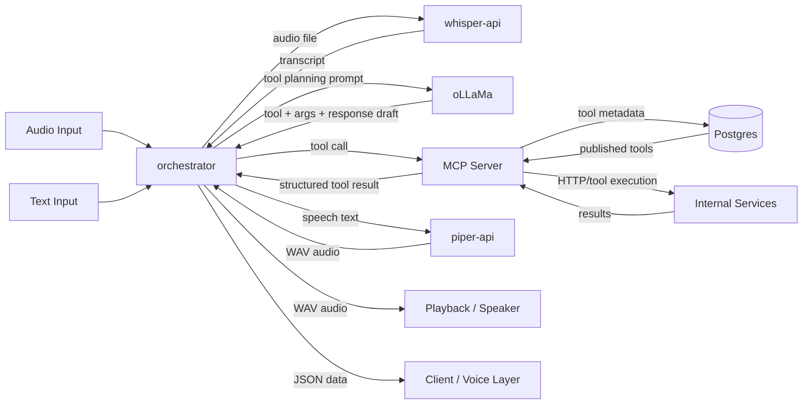
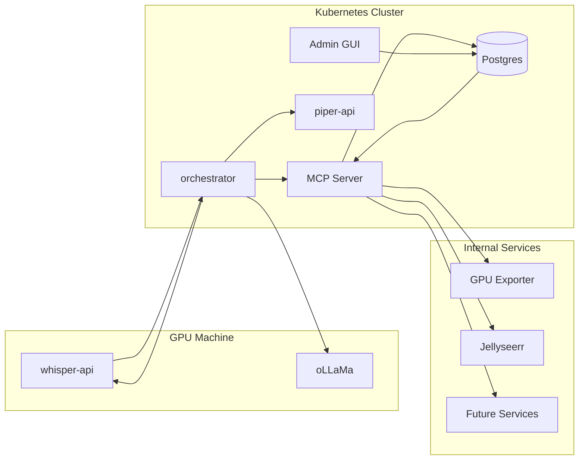
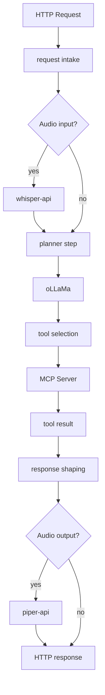
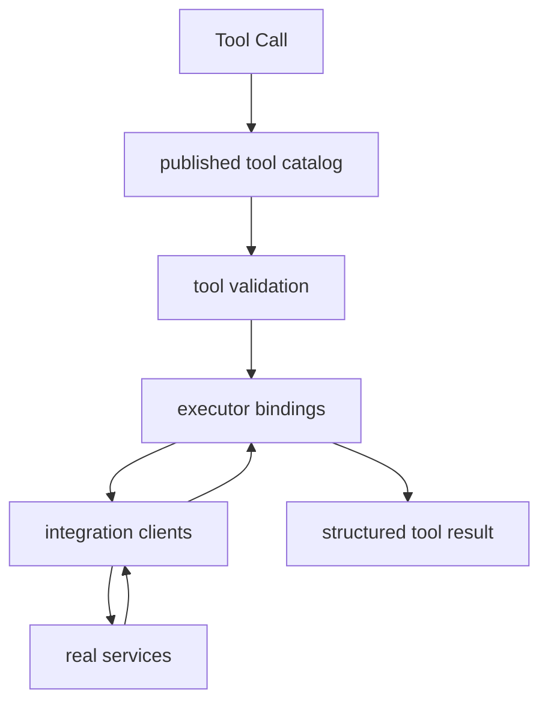

# Architecture

## Overview

Diakonos-Assist is moving toward a split between a user-facing orchestrator and a dedicated MCP tool server.

The target architecture is:

- `orchestrator` handles audio/text intake, planning, response shaping, and voice-pipeline coordination
- `mcp-server` exposes tools, validates tool calls, executes integrations, and returns structured results
- `postgres` stores tool metadata, versions, and publication state
- `ollama` handles planning / LLM inference
- `whisper-api` handles speech-to-text
- `piper-api` handles text-to-speech using Piper's built-in HTTP server and a baked-in local voice model
- internal homelab services provide the actual functionality

The important point is that the orchestrator coordinates the user workflow, while the MCP server owns tool execution.

## High-Level Flow

## Deployment Split

### Why this split

`ollama/` and `whisper-api/` should live on a GPU machine because they are inference-heavy.

`piper-api/` is lighter and can run on CPU, but keeping it on the same AI host usually keeps the voice path simpler:

- STT in
- planning and tool selection in the middle
- TTS out

The orchestrator can run almost anywhere because it mainly does:

- request intake
- speech and text routing
- upstream HTTP calls
- planner coordination
- failure forwarding
- response shaping
- binary audio response handling

The MCP server can also run almost anywhere because it mainly does:

- tool discovery
- tool validation
- tool execution dispatch
- integration calls
- result shaping

Folding `pipeline-server` into the orchestrator is reasonable because its responsibilities were already orchestration concerns rather than a distinct business domain.

## Orchestrator Responsibilities

The orchestrator replaces the old split between `pipeline-server` and `process-api`.

Its job is:

- receive text requests
- receive uploaded or raw audio
- call `whisper-api` when transcription is needed
- call `ollama` to choose a tool and draft a short response
- call the MCP server to execute the selected tool
- call `piper-api` when audio output is required
- return either JSON, plain text, or generated WAV audio
- surface failure context with service and state metadata

### Request modes

The orchestrator should support at least three modes:

1. text planning mode
2. direct tool mode
3. audio pipeline mode

Text planning mode:

- input: `{ "speech": "..." }`
- sends available tools to `ollama`
- receives a selected tool and args
- calls the MCP server with that tool selection
- returns structured JSON plus a voice-friendly response string

Direct tool mode:

- input: `{ "tool": "...", "args": {} }`
- skips `ollama` entirely
- calls the MCP server directly
- returns deterministic execution results

Audio pipeline mode:

- input: audio bytes or multipart upload
- sends audio to `whisper-api`
- plans from the transcript
- executes through the MCP server
- optionally synthesises the response through `piper-api`

This keeps direct mode useful for deterministic testing while giving one service ownership of the full voice path.

### Internal layers

## MCP Server Responsibilities

The MCP server is the tool execution boundary.

Its job is:

- expose planner-visible tools
- validate tool call arguments
- execute the correct integration
- return structured results
- hide unpublished or invalid tools
- keep execution code separate from planner logic

Conceptually, the orchestrator answers "what should be called?" and the MCP server answers "how is that tool actually run?"

### Internal layers

## Tool Metadata And Postgres

Tool metadata should move to Postgres, but executor implementations should remain in version-controlled source.

This is an important distinction:

- Postgres owns metadata
- source code owns execution

The system should not allow arbitrary executable logic to be defined in the database.

### What belongs in Postgres

Store:

- tool name
- description
- integration key
- argument schema JSON
- execution summary
- enabled or disabled state
- planner visibility
- metadata version
- draft or published state
- human notes

### What stays in source code

Keep:

- executor implementations
- integration clients
- validation helpers
- hard safety checks
- allow-list of executable integration keys

### Suggested entities

A minimal schema should include:

- `integrations`
- `tools`
- `tool_versions`
- `tool_publish_events`

The important operational rule is that only published and validated tool metadata should be exposed by the MCP server.

## Admin GUI

An admin GUI becomes useful once tool metadata lives in Postgres.

It should support:

- creating tool drafts
- editing descriptions and schemas
- toggling planner visibility
- previewing planner-facing tool JSON
- validating metadata against known executor bindings
- publishing and rolling back metadata versions

The GUI should never:

- upload executable code
- define arbitrary executor logic
- bypass integration allow-lists

That keeps the system flexible without turning it into remote code execution.

## Integration Layer

Integration clients belong behind the MCP server.

Purpose:

- contain the real request and response logic for upstream services
- isolate auth, base URLs, HTTP request shapes, and parsing

Current integrations:

- GPU status
- Jellyseerr

This layer is where service-specific code belongs. It is not where tool selection belongs.

## Unsupported Requests

Unsupported requests should still be handled explicitly.

The planner should choose an explicit unsupported path when the user asks for something outside the published tool set.

This avoids forcing random requests into the closest available tool.

## Logging Model

Logging should stay request-scoped and split by responsibility.

At the orchestrator layer, log:

- incoming request
- transcription step
- planner selection
- MCP calls
- TTS calls
- final request summary

At the MCP layer, log:

- tool discovery or publication state used for the request
- incoming tool call
- validation failures
- outbound integration calls
- final execution summary

## What Is Not In Postgres

Postgres should not store:

- executable code
- auth tokens
- service URLs
- machine-specific settings

Those belong in source control or deployment configuration, depending on the type of data.

## Migration Direction

The safest migration path is:

1. keep executor code where it is
2. extract tool discovery and execution behind an MCP server
3. move only tool metadata into Postgres
4. add strict validation between published metadata and executor bindings
5. add an admin GUI for draft, validate, publish, and rollback workflows
6. fold `pipeline-server` into the orchestrator and retire the split audio path

This gives a cleaner long-term architecture without making the runtime path less deterministic.

## Related Documents

See:

- [Tool Registry Future](./TOOL-REGISTRY-FUTURE.md)
