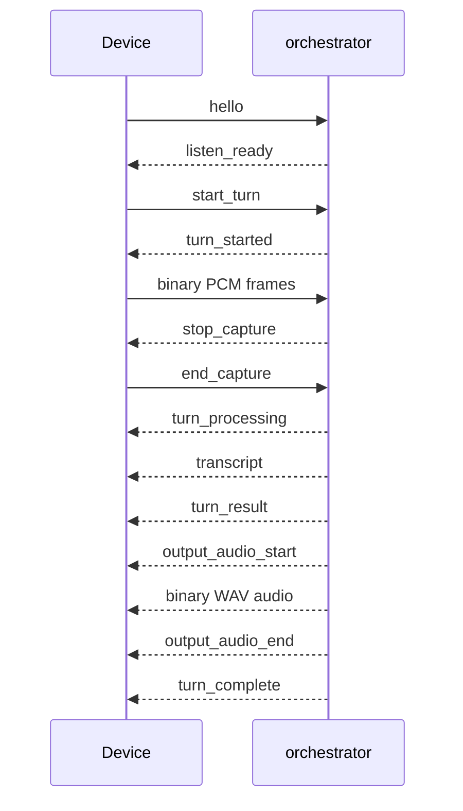
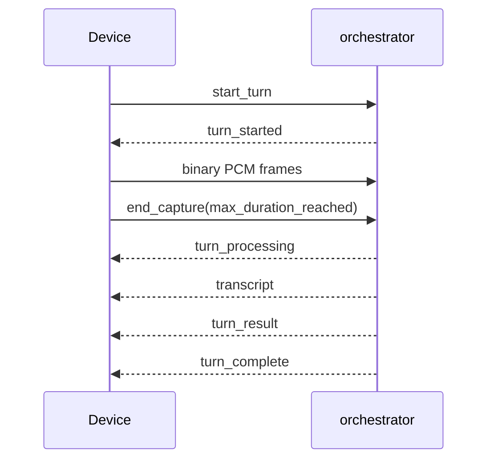

# Voice Node Protocol Examples

## Purpose

This document gives concrete JSON examples for the websocket protocol used by voice edge devices talking to the orchestrator over:

- `WS /api/v1/listen`

It is a companion to:

- [Voice Node Requirements](./VOICE_NODE_REQS.md)
- [Architecture](./ARCHITECTURE.md)

All examples here assume:

- the device has already been paired
- the orchestrator has already assigned the canonical `device_id`
- bearer device auth is already configured
- audio format is `pcm_s16le`, mono, `16000Hz`
- control messages are JSON text frames
- audio is sent as binary websocket frames

Pre-pairing discovery is a separate local-network flow. Unpaired devices should expose only a temporary bootstrap handle or pairing code and should not use a MAC address as an application identifier.

## Pre-Pairing Bootstrap Example

Before `/listen` is allowed, the device is still unpaired. It should advertise a temporary handle that lets the admin select the correct unit without inventing a permanent identity on the device itself.

### Example Pairing Payload Written By The Orchestrator

```json
{
  "pairing_protocol_version": 1,
  "bootstrap_id": "setup-a7k4",
  "device_id": "7a4c9452-6f6a-40d8-bf60-63b1c0b2eb7f",
  "display_name": "Kitchen Speaker",
  "token": "<device-token>",
  "orchestrator_base_url": "http://clankassist.local:3000"
}
```

## Connection Setup

### 1. Websocket Upgrade

The device opens:

```text
WS /api/v1/listen
Authorization: Bearer <device-token>
```

### 2. Client `hello`

The paired device should send a single `hello` event after connect.

```json
{
  "event": "hello",
  "device_id": "7a4c9452-6f6a-40d8-bf60-63b1c0b2eb7f",
  "display_name": "Kitchen Speaker",
  "firmware_version": "0.3.0",
  "protocol_version": 1,
  "audio": {
    "input": {
      "encoding": "pcm_s16le",
      "sample_rate_hz": 16000,
      "channels": 1
    },
    "output": {
      "preferred_content_types": ["audio/wav"]
    }
  },
  "capabilities": {
    "wake_word": true,
    "speaker": true,
    "display": false
  }
}
```

### 3. Server `listen_ready`

Example:

```json
{
  "event": "listen_ready",
  "connection_id": "2f0af9f5-72df-402e-bd10-e04f27ebf6e5",
  "device_id": "7a4c9452-6f6a-40d8-bf60-63b1c0b2eb7f",
  "mode": "session",
  "wake_word_detection": "edge",
  "supported_audio_formats": [
    {
      "encoding": "pcm_s16le",
      "sample_rate_hz": 16000,
      "channels": 1
    }
  ],
  "capture": {
    "server_stop_capture_enabled": true,
    "client_end_capture_required": true,
    "max_capture_ms": 15000,
    "max_audio_bytes": 480000,
    "max_frame_bytes": 32768
  },
  "vad": {
    "strategy": "silero_vad_16k_op15",
    "state": "idle",
    "capture_state": "idle",
    "chunk_duration_ms": 32
  },
  "message": "WebSocket session ready."
}
```

### 4. Optional Server `hello_ack`

```json
{
  "event": "hello_ack",
  "connection_id": "2f0af9f5-72df-402e-bd10-e04f27ebf6e5",
  "device_id": "7a4c9452-6f6a-40d8-bf60-63b1c0b2eb7f"
}
```

## Starting A Turn

### Client `start_turn`

Sent after local wake-word detection.

```json
{
  "event": "start_turn",
  "turn_id": "turn-2026-04-15T17-06-44-001Z",
  "output": "audio",
  "pre_roll_ms": 500,
  "audio_format": {
    "encoding": "pcm_s16le",
    "sample_rate_hz": 16000,
    "channels": 1
  }
}
```

### Server `turn_started`

```json
{
  "event": "turn_started",
  "turn_id": "turn-2026-04-15T17-06-44-001Z",
  "output": "audio",
  "audio_format": {
    "encoding": "pcm_s16le",
    "sample_rate_hz": 16000,
    "channels": 1
  },
  "capture": {
    "server_stop_capture_enabled": true,
    "client_end_capture_required": true,
    "max_capture_ms": 15000,
    "max_audio_bytes": 480000,
    "max_frame_bytes": 32768
  },
  "vad": {
    "strategy": "silero_vad_16k_op15",
    "state": "capturing",
    "capture_state": "idle",
    "stop_reason": null,
    "last_speech_probability": null,
    "last_speech_start_sample": null,
    "last_speech_end_sample": null,
    "chunk_duration_ms": 32
  },
  "message": "Turn accepted. Audio buffering is active and the server will issue stop_capture based on Silero VAD or the hard capture limit."
}
```

## Audio Frames

After `turn_started`, the client sends binary websocket frames.

These are not JSON. They are raw PCM bytes in the agreed format:

- signed 16-bit little-endian samples
- mono
- 16000 Hz

The first audio frames may contain buffered pre-roll audio captured before wake-word detection.

## Server-Ended Capture Example



### Server `stop_capture`

When VAD decides the utterance is over:

```json
{
  "event": "stop_capture",
  "turn_id": "turn-2026-04-15T17-06-44-001Z",
  "reason": "vad_silence_detected",
  "audio_bytes_received": 117248,
  "audio_frame_count": 117,
  "duration_ms": 3664,
  "vad": {
    "strategy": "silero_vad_16k_op15",
    "state": "server_stop_requested",
    "capture_state": "ended",
    "stop_reason": "vad_silence_detected",
    "last_speech_probability": 0.071,
    "last_speech_start_sample": 1792,
    "last_speech_end_sample": 55808,
    "chunk_duration_ms": 32
  }
}
```

### Client `end_capture`

After `stop_capture`, the client must stop audio immediately and then confirm capture has ended:

```json
{
  "event": "end_capture",
  "turn_id": "turn-2026-04-15T17-06-44-001Z",
  "reason": "server_stop_capture"
}
```

### Server `turn_processing`

```json
{
  "event": "turn_processing",
  "turn_id": "turn-2026-04-15T17-06-44-001Z",
  "reason": "server_stop_capture",
  "audio_bytes_received": 117248,
  "audio_frame_count": 117,
  "duration_ms": 3664,
  "utterance": {
    "filename": "turn-2026-04-15T17-06-44-001Z.wav",
    "content_type": "audio/wav",
    "wav_bytes": 117292,
    "pcm_bytes": 117248
  },
  "vad": {
    "strategy": "silero_vad_16k_op15",
    "state": "capture_ended",
    "capture_state": "ended",
    "stop_reason": "vad_silence_detected",
    "last_speech_probability": 0.071,
    "last_speech_start_sample": 1792,
    "last_speech_end_sample": 55808,
    "chunk_duration_ms": 32
  }
}
```

### Server `transcript`

```json
{
  "event": "transcript",
  "turn_id": "turn-2026-04-15T17-06-44-001Z",
  "transcript": "what temperature is my gpu"
}
```

### Server `turn_result`

```json
{
  "event": "turn_result",
  "turn_id": "turn-2026-04-15T17-06-44-001Z",
  "mode": "listen_turn",
  "output": "audio",
  "unsupported": false,
  "transcript": "what temperature is my gpu",
  "selection": {
    "tool": "gpu.status",
    "args": {}
  },
  "response": "Your GPU is at 54 degrees Celsius.",
  "result": {
    "content": [
      {
        "type": "text",
        "text": "Your GPU is at 54 degrees Celsius."
      }
    ],
    "structuredContent": {
      "temperature_c": 54
    }
  },
  "utterance": {
    "filename": "turn-2026-04-15T17-06-44-001Z.wav",
    "content_type": "audio/wav",
    "wav_bytes": 117292,
    "pcm_bytes": 117248
  },
  "vad": {
    "strategy": "silero_vad_16k_op15",
    "state": "capture_ended",
    "capture_state": "ended",
    "stop_reason": "vad_silence_detected",
    "last_speech_probability": 0.071,
    "last_speech_start_sample": 1792,
    "last_speech_end_sample": 55808,
    "chunk_duration_ms": 32
  }
}
```

### Server `output_audio_start`

```json
{
  "event": "output_audio_start",
  "turn_id": "turn-2026-04-15T17-06-44-001Z",
  "content_type": "audio/wav",
  "bytes": 84532
}
```

### Server Binary Audio

Immediately after `output_audio_start`, the server sends a binary websocket frame containing the response audio.

In the current implementation this is one binary frame containing the whole WAV payload.

### Server `output_audio_end`

```json
{
  "event": "output_audio_end",
  "turn_id": "turn-2026-04-15T17-06-44-001Z",
  "content_type": "audio/wav",
  "bytes": 84532
}
```

### Server `turn_complete`

```json
{
  "event": "turn_complete",
  "turn_id": "turn-2026-04-15T17-06-44-001Z",
  "status": "completed",
  "capture_end_reason": "server_stop_capture",
  "audio_bytes_received": 117248,
  "audio_frame_count": 117,
  "duration_ms": 3664,
  "utterance": {
    "filename": "turn-2026-04-15T17-06-44-001Z.wav",
    "content_type": "audio/wav",
    "wav_bytes": 117292,
    "pcm_bytes": 117248
  },
  "vad": {
    "strategy": "silero_vad_16k_op15",
    "state": "capture_ended",
    "capture_state": "ended",
    "stop_reason": "vad_silence_detected",
    "last_speech_probability": 0.071,
    "last_speech_start_sample": 1792,
    "last_speech_end_sample": 55808,
    "chunk_duration_ms": 32
  },
  "message": "Your GPU is at 54 degrees Celsius."
}
```

## Client-Ended Capture Example

This is the path where the device reaches a local hard stop before the server asks it to stop.



### Client `end_capture` Due To Local Limit

```json
{
  "event": "end_capture",
  "turn_id": "turn-2026-04-15T17-08-19-144Z",
  "reason": "max_duration_reached"
}
```

### Server `turn_complete` For Unsupported Request

```json
{
  "event": "turn_complete",
  "turn_id": "turn-2026-04-15T17-08-19-144Z",
  "status": "unsupported",
  "capture_end_reason": "max_duration_reached",
  "audio_bytes_received": 224256,
  "audio_frame_count": 219,
  "duration_ms": 7008,
  "utterance": {
    "filename": "turn-2026-04-15T17-08-19-144Z.wav",
    "content_type": "audio/wav",
    "wav_bytes": 224300,
    "pcm_bytes": 224256
  },
  "vad": {
    "strategy": "silero_vad_16k_op15",
    "state": "capture_ended",
    "capture_state": "speaking",
    "stop_reason": null,
    "last_speech_probability": 0.88,
    "last_speech_start_sample": 512,
    "last_speech_end_sample": null,
    "chunk_duration_ms": 32
  },
  "message": "I cannot help with that request using the available tools."
}
```

## Text Output Example

If the client requested text output:

### Client `start_turn`

```json
{
  "event": "start_turn",
  "turn_id": "turn-2026-04-15T17-10-00-010Z",
  "output": "text",
  "pre_roll_ms": 400,
  "audio_format": {
    "encoding": "pcm_s16le",
    "sample_rate_hz": 16000,
    "channels": 1
  }
}
```

### Server `turn_result`

```json
{
  "event": "turn_result",
  "turn_id": "turn-2026-04-15T17-10-00-010Z",
  "mode": "listen_turn",
  "output": "text",
  "unsupported": false,
  "transcript": "what time is it",
  "selection": {
    "tool": "system.time",
    "args": {}
  },
  "response": "It is 5:10 PM.",
  "result": {
    "content": [
      {
        "type": "text",
        "text": "It is 5:10 PM."
      }
    ]
  }
}
```

There should be no `output_audio_start` or binary audio for this turn.

## Error Examples

### Unsupported Audio Format

```json
{
  "event": "error",
  "code": "invalid_start_turn",
  "message": "Unsupported audio format. Expected pcm_s16le mono at 16000Hz.",
  "turn_id": "turn-2026-04-15T17-11-22-000Z",
  "recoverable": true,
  "details": null
}
```

### Turn Already Active

```json
{
  "event": "error",
  "code": "turn_already_active",
  "message": "A turn is already active for this connection.",
  "turn_id": "turn-2026-04-15T17-12-09-200Z",
  "recoverable": true,
  "details": null
}
```

### Previous Turn Still Processing

```json
{
  "event": "error",
  "code": "turn_processing_in_progress",
  "message": "A previous turn is still processing for this connection.",
  "turn_id": "turn-2026-04-15T17-12-09-200Z",
  "recoverable": true,
  "details": null
}
```

### Processing Failure

```json
{
  "event": "error",
  "code": "turn_processing_failed",
  "message": "Turn processing failed.",
  "turn_id": "turn-2026-04-15T17-13-01-999Z",
  "recoverable": false,
  "details": {
    "error": "Whisper transcription request failed."
  }
}
```

## Keepalive Example

### Server `ping`

```json
{
  "event": "ping"
}
```

### Client `pong`

```json
{
  "event": "pong"
}
```

## Implementation Notes For Device Authors

- Treat binary frames after `stop_capture` as a bug in the client.
- Do not send a new `start_turn` until `turn_complete` for the previous turn has been received.
- The current server implementation sends response audio as a single binary frame between `output_audio_start` and `output_audio_end`.
- Future protocol revisions may chunk response audio across multiple binary frames, so use the control events as boundaries instead of assuming a single frame forever.
