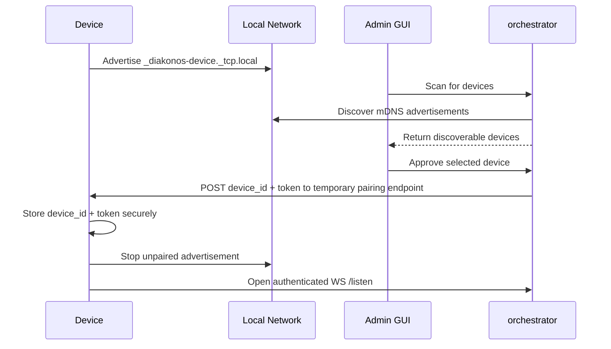
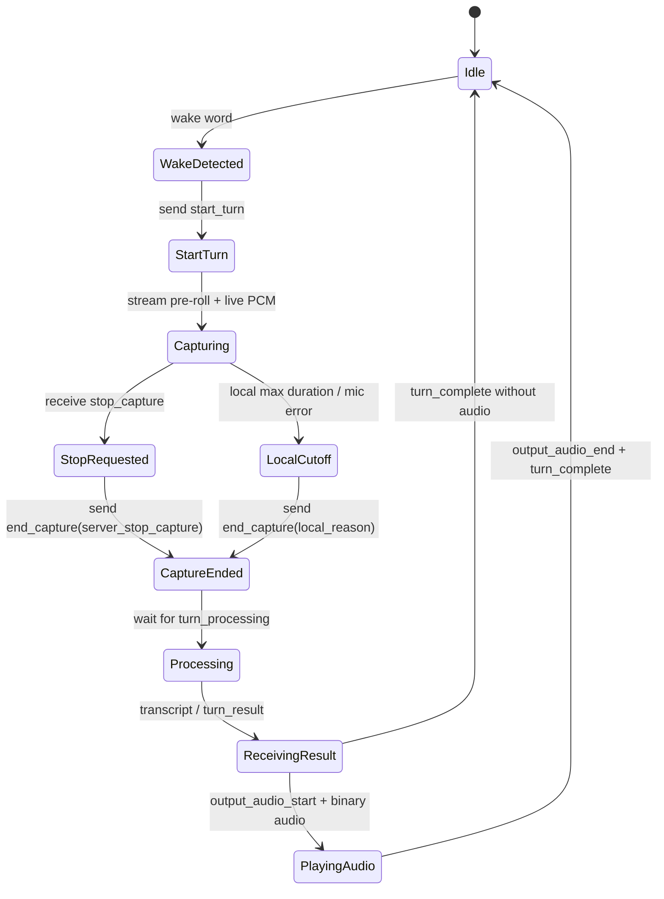

# Voice Node Requirements

## Purpose

This document defines what a voice-collecting edge device must do to participate in Diakonos Assist as a first-class mic/speaker endpoint.

Concrete websocket payload examples live in:

- [Voice Node Protocol Examples](./VOICE_NODE_PROTOCOL_EXAMPLES.md)

The device is expected to:

- join a user's Wi-Fi network with a user-friendly setup flow
- advertise itself on the LAN for discovery and pairing
- store a device token issued by the orchestrator
- store an orchestrator-issued canonical `device_id` after pairing
- detect the wake word locally
- maintain a long-lived websocket session to the orchestrator
- stream captured audio turns with pre-roll
- stop capture when told by the orchestrator or when local limits are reached
- play back returned audio responses
- expose enough local UX to be usable and debuggable without SSH

The edge device should be intentionally narrow in scope:

- wake-word detection at the edge
- microphone capture and speaker playback at the edge
- network onboarding and pairing at the edge
- VAD, STT, planning, MCP execution, and response generation in the orchestrator

## High-Level Role

## Core Responsibilities

The device must provide:

- microphone input
- speaker output
- local wake-word detection
- pre-roll audio buffering before wake-word trigger
- Wi-Fi onboarding
- local-network discovery
- pairing-token receipt and secure storage
- persistent websocket connection management
- audio turn capture and upload
- server-driven capture stop handling
- audio response playback
- local status indication

The device should not perform:

- server-side VAD
- speech-to-text
- LLM planning
- tool execution
- catalog or admin actions

## Device Capabilities

Minimum practical hardware capabilities:

- microphone suitable for voice capture
- speaker or headphone output
- enough RAM for:
  - wake-word runtime
  - circular pre-roll buffer
  - active websocket I/O
  - buffered playback
- non-volatile storage for:
  - Wi-Fi credentials
  - issued device token
  - orchestrator-issued device identity and settings
- physical recovery path such as:
  - reset/setup button
  - long-press factory reset
- visible status indicator such as:
  - LED
  - small display
  - both

Recommended extras:

- mute button
- push-to-talk button for fallback operation
- volume controls
- battery status reporting if portable
- OTA update support

## Boot And Setup Modes

The device should have at least three operating modes:

1. unconfigured
2. unpaired
3. paired

### Unconfigured

If the device has no Wi-Fi credentials:

- start its own temporary access point
- host a small local captive-style setup portal
- allow the user to enter:
  - Wi-Fi SSID
  - Wi-Fi password
  - optionally orchestrator hostname or base URL
- validate and store credentials securely
- reboot or reconnect into station mode

### Unpaired

If the device has Wi-Fi but no issued device token:

- connect to Wi-Fi
- advertise itself over mDNS / Bonjour as discoverable
- expose a tiny temporary pairing endpoint
- remain visible to the orchestrator admin discovery flow
- avoid opening authenticated `/listen` sessions until paired

### Paired

If the device has a valid token:

- connect to Wi-Fi
- stop advertising as unpaired
- optionally still advertise a paired service record for diagnostics
- maintain an authenticated websocket session to `/api/v1/listen`

## Local Network Portal

The onboarding portal should:

- run only during setup mode or when explicitly re-enabled
- preferably be reachable via a predictable captive hostname such as `http://clankassist-setup.local`
- clearly show:
  - device name
  - temporary bootstrap handle or pairing code
  - current firmware version
  - detected nearby SSIDs if the platform supports scanning
- provide a reset path if connection fails
- time out back into setup mode cleanly if Wi-Fi association cannot be completed

The portal should not expose:

- admin capabilities
- debug shell access
- stored secrets in plaintext

## Discovery And Pairing

This should match the discovery direction in `docs/AUTH-AND-DISCOVERY.md`.

Identity rules:

- the device must not use its MAC address as its application identity
- the canonical `device_id` is assigned by the orchestrator during pairing approval
- before pairing, the device should expose only a temporary bootstrap handle or pairing code
- the bootstrap handle exists only to distinguish unpaired devices during discovery and approval

### mDNS / Bonjour

When unpaired, the device should advertise itself via mDNS.

Recommended service:

- `_diakonos-device._tcp.local`

Recommended TXT metadata:

- `bootstrap_id`
- `pairing_code`
- `display_name`
- `model`
- `fw_version`
- `hostname`
- `capabilities=mic,speaker`
- `pairing_port`
- `pairing_protocol_version`
- `pairing_state=unpaired`

### Pairing Endpoint

The unpaired device should expose a minimal temporary pairing endpoint on the local network so the orchestrator can deliver the issued token after admin approval.

That endpoint should:

- accept only the minimum pairing payload needed
- validate the expected pairing protocol version
- store the issued token securely
- store the orchestrator-issued canonical `device_id`
- store any approved display name and server URL overrides
- move the device into paired state
- disable unpaired discovery advertisement

### Pairing Flow

## Identity And Secret Storage

The device must persist:

- orchestrator-issued `device_id`
- display name
- orchestrator base URL or hostname
- Wi-Fi credentials
- device bearer token

The device may also persist:

- a temporary bootstrap handle for setup UX before pairing

The device should:

- store secrets outside normal logs
- avoid printing tokens to serial after pairing
- wipe token and Wi-Fi credentials on factory reset
- support token replacement if the orchestrator rotates credentials

## Wake Word And Capture

Wake-word detection must happen on the device.

The device should:

- continuously monitor microphone input locally
- maintain a circular pre-roll buffer before wake-word detection
- trigger a new turn only after a positive wake-word match
- immediately flush pre-roll audio into the turn once capture starts

Recommended local behavior:

- pre-roll: around `300ms` to `1000ms`
- local hard max capture: around `10s` to `20s`
- microphone mute should block wake-word activation
- optional push-to-talk should bypass wake-word if present

The device should not wait for server approval before beginning capture after wake-word detection. It should start the turn immediately and stream the pre-roll first.

## Audio Format

The current listen protocol expects:

- `pcm_s16le`
- mono
- `16000Hz`

The device must:

- capture or resample into this format before sending
- split uploaded audio into binary websocket frames
- ensure frames remain sample-aligned
- avoid sending arbitrary encoded formats unless the protocol is expanded later

## Websocket Session Requirements

The device should maintain a long-lived authenticated websocket to:

- `WS /api/v1/listen`

It must:

- authenticate with a device bearer token
- send `hello` once connected
- wait for `listen_ready`
- keep exactly one active capture turn at a time on the connection
- reuse the same socket across many turns

### Required Client Events

- `hello`
- `start_turn`
- binary PCM frames
- `end_capture`
- `cancel_turn`
- `pong` if the server uses heartbeat frames

### Required Server Event Handling

The device must correctly handle:

- `listen_ready`
- `turn_started`
- `stop_capture`
- `turn_processing`
- `transcript`
- `turn_result`
- `output_audio_start`
- binary response audio
- `output_audio_end`
- `turn_complete`
- `error`
- `ping`

## Turn Lifecycle

## Capture Rules

The device must:

- send `start_turn` with a fresh `turn_id`
- include the selected output mode
- include audio format metadata
- send binary audio frames immediately after `start_turn`
- send pre-roll frames first
- stop sending audio immediately when `stop_capture` arrives
- send `end_capture` after capture has actually stopped

If the device terminates capture locally:

- it must stop microphone streaming
- it must send `end_capture`
- it must provide a reason such as:
  - `max_duration_reached`
  - `mic_error`
  - `user_cancelled`

After `stop_capture` or `end_capture`:

- no further audio frames should be sent for that turn
- if extra frames are generated locally they should be discarded

## Response Handling

The device must be able to handle:

- transcript-only visibility for debugging
- structured response metadata from `turn_result`
- optional audio playback when output mode is `audio`

If audio output is requested:

- wait for `output_audio_start`
- buffer or stream returned audio safely
- complete playback before marking the local interaction idle
- handle missing or truncated response audio gracefully

If text or JSON output is requested:

- still respect `turn_complete`
- optionally show the transcript or response on a local display

## Playback Requirements

The speaker path should:

- support the response format returned by the orchestrator
- avoid blocking network reads for too long while playing
- recover cleanly if playback fails halfway through

The device should:

- support volume control
- avoid acoustic feedback where possible
- pause or suppress wake-word triggers during playback if the hardware is prone to self-triggering

## Resilience Requirements

The device must survive:

- Wi-Fi drops
- orchestrator restarts
- websocket disconnects
- token revocation
- power loss

Expected behavior:

- reconnect Wi-Fi automatically
- reconnect websocket automatically with backoff
- reopen `/listen` after transient failures
- re-enter setup mode only when credentials are missing or deliberately cleared
- re-enter unpaired mode only when the token is missing, invalid, or explicitly revoked

Recommended retry strategy:

- short retry interval for transient disconnects
- exponential backoff for repeated failures
- visible local status so the user can tell whether the device is:
  - offline
  - connecting
  - paired but disconnected
  - ready
  - listening
  - processing
  - playing
  - error

## Health And Observability

The device should expose enough visibility for support without full remote access.

Recommended local diagnostics:

- current mode: setup / unpaired / paired
- Wi-Fi status
- orchestrator connectivity
- websocket connection status
- last error
- firmware version
- canonical `device_id` when paired
- bootstrap handle or pairing code when unpaired

Recommended optional debug endpoint:

- local read-only health summary

The device should never expose:

- raw bearer token
- Wi-Fi password
- arbitrary file access

## Recovery And Reset

The device should support:

- soft reboot
- reconnect Wi-Fi
- reopen websocket
- re-run setup portal
- full factory reset

Factory reset should clear:

- Wi-Fi credentials
- device token
- local pairing state
- cached server URL overrides

## Firmware And Update Behavior

Recommended:

- OTA firmware update support
- signed or otherwise trusted update source
- rollback or safe recovery path if update fails

The device should report its firmware version in:

- mDNS TXT records
- `hello`
- local diagnostics UI

## Sensible Nice-To-Haves

Useful additions that are not strict requirements:

- local chime on wake-word trigger
- local chime on response start
- mute indicator
- battery and charging telemetry
- ambient noise calibration
- configurable wake-word sensitivity
- local fallback push-to-talk mode

## Non-Goals

The device is not responsible for:

- performing LLM inference
- running MCP tools
- exposing admin workflows
- storing orchestrator-side catalog state

## Summary

A production-ready voice node must be more than a microphone with a websocket client.

It should be a self-contained appliance that can:

- onboard itself onto Wi-Fi through a local portal
- advertise itself for discovery over mDNS
- receive and store an issued device token
- detect wake words locally
- stream pre-roll and live audio turns over `/listen`
- obey `stop_capture` immediately
- send `end_capture` reliably
- handle transcripts, structured results, and response audio
- reconnect and recover without manual intervention

That is the minimum bar for a device that feels like a consumer-ready edge endpoint rather than a dev board demo.
